# How Tools Work

This guide provides a comprehensive explanation of how tools work in TanStack AI, from the initial tool call to execution and the agentic cycle. We'll cover the flow of data, execution contexts, and the coordination between client and server.

## Table of Contents

- [Overview](#overview)
- [Tool Call Flow: Client to LLM Service](#tool-call-flow-client-to-llm-service)
- [Server-Side Tool Execution](#server-side-tool-execution)
- [Client-Side Tool Execution](#client-side-tool-execution)
- [The Agentic Cycle](#the-agentic-cycle)
- [Tool States and Lifecycle](#tool-states-and-lifecycle)
- [Advanced Patterns](#advanced-patterns)

## Overview

Tools (also called "function calling") enable AI models to interact with external systems, execute code, and perform actions beyond text generation. TanStack AI supports:

- **Server Tools**: Execute on the backend with access to databases, APIs, and secure resources
- **Client Tools**: Execute in the browser with access to UI, local storage, and browser APIs
- **Hybrid Tools**: Can execute in both environments
- **Approval Flow**: Tools that require user approval before execution

The tool system uses a streaming architecture where chunks of data flow from the LLM service through the server and to the client, enabling real-time updates and responsive UIs.

---

## Tool Call Flow: Client to LLM Service

When a user sends a message that requires tool usage, the following flow occurs:


### Step-by-Step Breakdown

1. **User Input**: The user types a message in the chat interface
2. **Client Request**: The browser sends a POST request to the server with:
   - Current conversation history (`messages`)
   - Optional data payload (`body`)
3. **Server Processing**: The server:
   - Receives the request
   - Extracts messages from the request body
   - Converts tool definitions into the LLM's expected format
   - Sends the request to the LLM service (OpenAI, Anthropic, etc.)
4. **LLM Decision**: The LLM service:
   - Analyzes the conversation and available tools
   - Decides whether to call a tool based on the user's request
   - Generates tool calls with arguments
5. **Streaming Response**: The LLM streams back chunks:
   - `tool_call` chunks with tool name and arguments
   - `content` chunks with text responses
   - `done` chunk when complete
6. **Client Updates**: The browser receives chunks and updates the UI in real-time

### Code Example

**Server (API Route):**

```typescript
import { chat, toStreamResponse } from "@tanstack/ai";
import { openai } from "@tanstack/ai-openai";
import { getWeather, sendEmail } from "./tools";

export async function POST(request: Request) {
  const { messages } = await request.json();

  // Create streaming chat with tools
  const stream = chat({
    adapter: openai(),
    messages,
    model: "gpt-4o",
    tools: [getWeather, sendEmail], // Tool definitions passed here
  });

  return toStreamResponse(stream);
}
```

**Client (React Component):**

```typescript
import { useChat, fetchServerSentEvents } from "@tanstack/ai-react";

function ChatComponent() {
  const { messages, sendMessage, isLoading } = useChat({
    connection: fetchServerSentEvents("/api/chat"),
  });

  return (
    <div>
      {messages.map((message) => (
        <div key={message.id}>{/* Render message */}</div>
      ))}
      <input onSubmit={(e) => sendMessage(e.target.value)} />
    </div>
  );
}
```

---

## Server-Side Tool Execution

Server tools execute automatically when called by the LLM. They have full access to server resources like databases, APIs, and environment variables.


### How It Works

1. **Tool Call Received**: Server receives a `tool_call` chunk from the LLM
2. **Argument Parsing**: The tool arguments (JSON string) are parsed and validated against the input schema
3. **Execution**: The tool's `execute` function is called with the parsed arguments
4. **Result Processing**: The result is:
   - Validated against the output schema (if defined)
   - Converted to a tool result message
   - Added to the conversation history
5. **Continuation**: The chat continues with the tool result, allowing the LLM to generate a response based on the result

### Server Tool Definition

```typescript
import { toolDefinition } from "@tanstack/ai";
import { z } from "zod";

const getUserDataDef = toolDefinition({
  name: "get_user_data",
  description: "Get user information from the database",
  inputSchema: z.object({
    userId: z.string().describe("The user ID to look up"),
  }),
  outputSchema: z.object({
    name: z.string(),
    email: z.string().email(),
    createdAt: z.string(),
  }),
});

const getUserData = getUserDataDef.server(async ({ userId }) => {
  // This runs on the server - secure access to database
  const user = await db.users.findUnique({ where: { id: userId } });
  return {
    name: user.name,
    email: user.email,
    createdAt: user.createdAt.toISOString(),
  };
});
```

### Automatic vs. Manual Execution

**Automatic (Default):**
- Server tools with an `execute` function run automatically
- Results are added to the conversation immediately
- No client-side handling required

**Manual (Advanced):**
- You can handle tool calls manually by intercepting the stream
- Useful for custom orchestration or approval flows

---

## Client-Side Tool Execution

Client tools execute in the browser, enabling UI updates, local storage access, and browser API interactions. Unlike server tools, client tools don't have an `execute` function in their server definition.


### How It Works

1. **Tool Call from LLM**: LLM decides to call a client tool
2. **Server Detection**: Server sees the tool has no `execute` function
3. **Client Notification**: Server sends a `tool-input-available` chunk to the browser
4. **Client Execution**: Browser's `onToolCall` callback is triggered with:
   - `toolName`: Name of the tool to execute
   - `input`: Parsed arguments
5. **Result Return**: Client executes the tool and returns the result
6. **Server Update**: Result is sent back to the server and added to the conversation
7. **LLM Continuation**: LLM receives the result and continues the conversation

### Client Tool Definition

**Server (Define the tool):**

```typescript
import { toolDefinition } from "@tanstack/ai";
import { z } from "zod";

// Client tool definition - will be executed on client
export const updateUIDef = toolDefinition({
  name: "update_ui",
  description: "Update the UI with new information",
  inputSchema: z.object({
    message: z.string().describe("Message to display"),
    type: z.enum(["success", "error", "info"]).describe("Message type"),
  }),
  outputSchema: z.object({
    success: z.boolean(),
  }),
});

// Pass the definition to chat() - no .server() needed for client tools
chat({
  tools: [updateUIDef], // Definition without execute - client will handle it
  // ...
});
```

**Client (Handle execution):**

```typescript
import { useChat, fetchServerSentEvents } from "@tanstack/ai-react";

function ChatComponent() {
  const [notification, setNotification] = useState(null);

  // Create client-side tool implementation
  const updateUI = updateUIDef.client(async ({ message, type }) => {
    // Update React state
    setNotification({ message, type });
    return { success: true };
  });

  const { messages, sendMessage } = useChat({
    connection: fetchServerSentEvents("/api/chat"),
    tools: [updateUI], // Pass client tool implementations
  });

  // ... rest of component
}
```

### When to Use Client Tools

- **UI Updates**: Show notifications, update forms, toggle visibility
- **Local Storage**: Save user preferences, cache data
- **Browser APIs**: Access geolocation, camera, clipboard
- **State Management**: Update React/Vue/Solid state
- **Navigation**: Change routes, scroll to sections

---

## The Agentic Cycle

The agentic cycle is the pattern where the LLM repeatedly calls tools, receives results, and continues reasoning until it can provide a final answer. This enables complex multi-step operations.


### Detailed Agentic Flow

```mermaid
sequenceDiagram
    participant User
    participant Client
    participant Server
    participant LLM
    participant Tools
    
    User->>Client: "What's the weather in SF and LA?"
    Client->>Server: Send message
    Server->>LLM: Message + tool definitions
    
    Note over LLM: Cycle 1: Call first tool
    
    LLM->>Server: tool_call: get_weather(SF)
    Server->>Tools: Execute get_weather
    Tools-->>Server: {temp: 65, conditions: "sunny"}
    Server->>LLM: tool_result
    
    Note over LLM: Cycle 2: Call second tool
    
    LLM->>Server: tool_call: get_weather(LA)
    Server->>Tools: Execute get_weather
    Tools-->>Server: {temp: 75, conditions: "clear"}
    Server->>LLM: tool_result
    
    Note over LLM: Cycle 3: Generate answer
    
    LLM-->>Server: content: "SF is 65°F..."
    Server-->>Client: Stream response
    Client->>User: Display answer
```



### Multi-Step Example

Here's a real-world example of the agentic cycle:

**User**: "Find me flights to Paris under $500 and book the cheapest one"

**Cycle 1**: LLM calls `searchFlights({destination: "Paris", maxPrice: 500})`
- Tool returns: `[{id: "F1", price: 450}, {id: "F2", price: 480}]`

**Cycle 2**: LLM analyzes results and calls `bookFlight({flightId: "F1"})`
- Tool requires approval (sensitive operation)
- User approves
- Tool returns: `{bookingId: "B123", confirmed: true}`

**Cycle 3**: LLM generates final response
- "I found 2 flights under $500. I've booked the cheapest one (Flight F1) for $450. Your booking ID is B123."

### Code Example: Agentic Weather Assistant

```typescript
// Tool definitions
const getWeatherDef = toolDefinition({
  name: "get_weather",
  description: "Get current weather for a city",
  inputSchema: z.object({
    city: z.string(),
  }),
});

const getClothingAdviceDef = toolDefinition({
  name: "get_clothing_advice",
  description: "Get clothing recommendations based on weather",
  inputSchema: z.object({
    temperature: z.number(),
    conditions: z.string(),
  }),
});

// Server implementations
const getWeather = getWeatherDef.server(async ({ city }) => {
  const response = await fetch(`https://api.weather.com/v1/${city}`);
  return await response.json();
});

const getClothingAdvice = getClothingAdviceDef.server(async ({ temperature, conditions }) => {
  // Business logic for clothing recommendations
  if (temperature < 50) {
    return { recommendation: "Wear a warm jacket" };
  }
  return { recommendation: "Light clothing is fine" };
});

// Server route
export async function POST(request: Request) {
  const { messages } = await request.json();

  const stream = chat({
    adapter: openai(),
    messages,
    model: "gpt-4o",
    tools: [getWeather, getClothingAdvice],
  });

  return toStreamResponse(stream);
}
```

**User**: "What should I wear in San Francisco today?"

**Agentic Cycle**:
1. LLM calls `get_weather({city: "San Francisco"})` → Returns `{temp: 62, conditions: "cloudy"}`
2. LLM calls `get_clothing_advice({temperature: 62, conditions: "cloudy"})` → Returns `{recommendation: "Light jacket recommended"}`
3. LLM generates: "The weather in San Francisco is 62°F and cloudy. I recommend wearing a light jacket."

---

## Tool States and Lifecycle

Tools progress through different states during their lifecycle. Understanding these states helps build robust UIs and debug tool execution.


### Tool Call States

| State | Description | Client Action |
|-------|-------------|---------------|
| `awaiting-input` | Tool call received, no arguments yet | Show loading |
| `input-streaming` | Partial arguments being received | Show progress |
| `input-complete` | All arguments received | Ready to execute |
| `approval-requested` | Waiting for user approval | Show approval UI |
| `approval-responded` | User has approved/denied | Execute or cancel |

### Tool Result States

| State | Description | Client Action |
|-------|-------------|---------------|
| `streaming` | Result being streamed (future feature) | Show progress |
| `complete` | Result is complete | Show result |
| `error` | Error occurred during execution | Show error message |

### Monitoring Tool States in React

```typescript
function ChatComponent() {
  const { messages } = useChat({
    connection: fetchServerSentEvents("/api/chat"),
  });

  return (
    <div>
      {messages.map((message) => (
        <div key={message.id}>
          {message.parts.map((part) => {
            if (part.type === "tool-call") {
              return (
                <div key={part.id} className="tool-status">
                  {/* Show state-specific UI */}
                  {part.state === "awaiting-input" && (
                    <div>🔄 Calling {part.name}...</div>
                  )}
                  {part.state === "input-streaming" && (
                    <div>📥 Receiving arguments...</div>
                  )}
                  {part.state === "input-complete" && (
                    <div>✓ Arguments ready</div>
                  )}
                  {part.state === "approval-requested" && (
                    <ApprovalUI part={part} />
                  )}
                </div>
              );
            }
            if (part.type === "tool-result") {
              return (
                <div key={part.toolCallId}>
                  {part.state === "complete" && (
                    <div>✓ Tool completed</div>
                  )}
                  {part.state === "error" && (
                    <div>❌ Error: {part.error}</div>
                  )}
                </div>
              );
            }
          })}
        </div>
      ))}
    </div>
  );
}
```

---

## Advanced Patterns

### Tool Approval Flow

For sensitive operations, tools can require user approval before execution:


**Define tool with approval:**

```typescript
const sendEmailDef = toolDefinition({
  name: "send_email",
  description: "Send an email",
  inputSchema: z.object({
    to: z.string().email(),
    subject: z.string(),
    body: z.string(),
  }),
  needsApproval: true, // Requires user approval
});

const sendEmail = sendEmailDef.server(async ({ to, subject, body }) => {
  await emailService.send({ to, subject, body });
  return { success: true };
});
```

**Handle approval in client:**

```typescript
const { messages, addToolApprovalResponse } = useChat({
  connection: fetchServerSentEvents("/api/chat"),
});

// In your render:
{part.state === "approval-requested" && (
  <div>
    <p>Approve sending email to {part.arguments.to}?</p>
    <button
      onClick={() =>
        addToolApprovalResponse({
          id: part.approval.id,
          approved: true,
        })
      }
    >
      Approve
    </button>
    <button
      onClick={() =>
        addToolApprovalResponse({
          id: part.approval.id,
          approved: false,
        })
      }
    >
      Deny
    </button>
  </div>
)}
```

### Hybrid Tools (Server + Client)

Some tools need to execute in both environments:

```typescript
// Server: Fetch data from database
const fetchUserPrefsDef = toolDefinition({
  name: "fetch_user_preferences",
  description: "Get user preferences from server",
  inputSchema: z.object({
    userId: z.string(),
  }),
});

const fetchUserPreferences = fetchUserPrefsDef.server(async ({ userId }) => {
  const prefs = await db.userPreferences.findUnique({ where: { userId } });
  return prefs;
});

// Client: Apply preferences to UI
const applyPrefsDef = toolDefinition({
  name: "apply_preferences",
  description: "Apply user preferences to the UI",
  inputSchema: z.object({
    theme: z.string(),
    language: z.string(),
  }),
});

// On client, create client implementation
const applyPreferences = applyPrefsDef.client(async ({ theme, language }) => {
  // Update UI state with preferences
  document.body.className = theme;
  i18n.changeLanguage(language);
  return { applied: true };
});

// Usage: LLM can chain these together
// 1. Call fetchUserPreferences (server)
// 2. Call applyPreferences with the result (client)
```

### Parallel Tool Execution

The LLM can call multiple tools in parallel for efficiency:


**Example:**

```
User: "Compare the weather in NYC, SF, and LA"

LLM calls:
- get_weather({city: "NYC"}) [index: 0]
- get_weather({city: "SF"}) [index: 1]
- get_weather({city: "LA"}) [index: 2]

All execute simultaneously, then LLM generates comparison.
```

---

## Best Practices

### Tool Design

1. **Single Responsibility**: Each tool should do one thing well
2. **Clear Descriptions**: Help the LLM understand when to use the tool
3. **Type Safety**: Use Zod schemas for input/output validation
4. **Error Handling**: Return meaningful error messages, don't throw
5. **Idempotency**: Tools should be safe to call multiple times

### Security

1. **Server vs Client**: Put sensitive operations on the server
2. **Approval Flow**: Use `needsApproval` for destructive actions
3. **Input Validation**: Always validate tool inputs
4. **Rate Limiting**: Implement rate limits for expensive tools
5. **Audit Logs**: Log tool executions for debugging and security

### Performance

1. **Caching**: Cache tool results when appropriate
2. **Parallel Execution**: Enable parallel tool calls when possible
3. **Streaming**: Use streaming for long-running operations
4. **Timeouts**: Set timeouts for external API calls
5. **Lazy Loading**: Load tools only when needed

---

## Summary

The TanStack AI tool system provides a powerful, flexible architecture for enabling AI agents to interact with external systems:

- **Server Tools** execute securely on the backend with automatic handling
- **Client Tools** execute in the browser for UI updates and local operations
- **The Agentic Cycle** enables multi-step reasoning and complex workflows
- **Tool States** provide real-time feedback and enable robust UIs
- **Approval Flow** gives users control over sensitive operations

This architecture enables building sophisticated AI applications that can:
- Fetch data from APIs and databases
- Perform calculations and transformations
- Update UIs and manage state
- Execute multi-step workflows
- Require user approval for sensitive actions

## Next Steps

- [Tools Overview](./tools.md) - Basic tool concepts and examples
- [Server Tools](./server-tools.md) - Deep dive into server-side tools
- [Client Tools](./client-tools.md) - Deep dive into client-side tools
- [Tool Approval Flow](./tool-approval.md) - Implementing approval workflows
- [Stream Chunk Definitions](../protocol/chunk-definitions.md) - Understanding the streaming protocol

